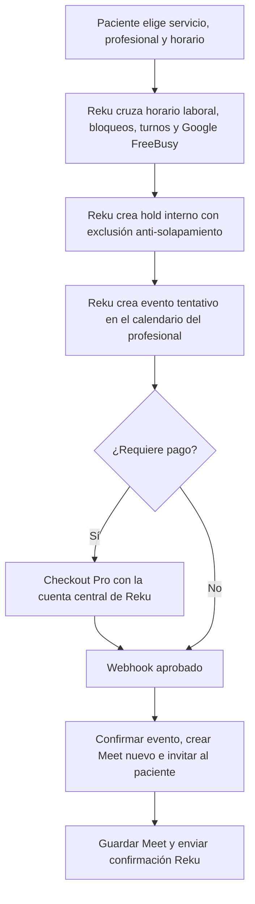

# Plan: portal Profesional, Google Calendar/Meet y Mercado Pago

Estado: alcance aprobado; MVP implementado. La integración con Google requiere credenciales y un piloto controlado.
Fecha: 2026-08-12.

## 1. Punto de partida

Reku ya cuenta con:

- `professionals`, servicios asignados, disponibilidad semanal y bloqueos puntuales.
- `appointments` con turnos confirmados y pendientes de pago.
- Checkout Pro con una única credencial central de Mercado Pago.
- Notificaciones por email al confirmar un turno.
- Una vista temporal `/profesional-turnos/`, autenticada mediante un enlace de corta duración, que sólo lista próximos turnos.
- Usuarios internos con roles `admin` y `user`, permisos de API default-deny y sesiones con cookie `HttpOnly` y CSRF.

Las brechas detectadas al iniciar eran:

- No existe un vínculo entre un usuario autenticable y un registro `professional`.
- La vista de profesional no es una cuenta permanente y no permite editar perfil, disponibilidad ni bloqueos.
- No existe una entidad canónica `patients`; los datos del paciente están repetidos entre altas y turnos.
- No hay cancelación de turnos, reembolso ni notificación de cancelación.
- Google Calendar/Meet no está integrado.
- No existe cancelación con reembolso automático sobre la cuenta central de Mercado Pago.
- El control actual de doble reserva usa `SELECT ... FOR UPDATE` sobre coincidencias existentes; debe reforzarse porque dos reservas simultáneas pueden no encontrar una fila que bloquear.

## 2. Decisiones de arquitectura

### 2.1 Identidad y autorización

Agregar el rol `professional` a `users` y vincular cada cuenta a exactamente un profesional mediante `users.professional_id`, con índice único para el modelo inicial de una cuenta por profesional.

El portal vivirá en `/profesional/` y usará la autenticación existente, generalizada como sesión de Reku. El backend nunca aceptará un `professional_id` provisto por el navegador para decidir el alcance: lo obtendrá de la sesión autenticada.

Permisos propuestos:

- `professional.profile.read_self`
- `professional.profile.write_self`
- `professional.availability.read_self`
- `professional.availability.write_self`
- `professional.blocks.read_self`
- `professional.blocks.write_self`
- `professional.patients.read_all`
- `professional.appointments.read_self`
- `professional.appointments.cancel_self`
- `professional.integrations.google.manage_self`

El rol profesional no tendrá acceso a `/admin/` ni a `/api/admin/*`. Se conservará temporalmente `/profesional-turnos/` sólo como compatibilidad para enlaces ya emitidos y luego se retirará.

### 2.2 Fuente de verdad de la agenda

- Reku será la fuente de verdad de horarios laborales, duración de servicios, bloqueos y estado comercial del turno.
- Google Calendar aportará ocupaciones externas mediante FreeBusy y alojará el evento/Meet de cada turno.
- No se leerán títulos, descripciones ni participantes de eventos personales: sólo intervalos ocupado/libre.
- Para el primer alcance se usará el calendario primario de la cuenta autorizada. Elegir entre varios calendarios puede agregarse después si realmente hace falta.
- Cada turno tendrá un Meet nuevo. No se reutilizará una sala fija entre pacientes.
- El alcance inicial contempla cuentas Google personales; no depende de un dominio Google Workspace administrado por Reku.

Scopes mínimos previstos:

- `https://www.googleapis.com/auth/calendar.events.owned`
- `https://www.googleapis.com/auth/calendar.freebusy`

Google permite crear eventos con el scope de eventos propios, consultar FreeBusy con un scope específico y generar un Meet mediante `conferenceData.createRequest` con `conferenceDataVersion=1`.

### 2.3 Modelo de cobro aprobado para esta etapa

Reku continuará cobrando el 100% mediante su Checkout Pro y sus credenciales centrales actuales. No se implementará por ahora OAuth de Mercado Pago ni onboarding de cuentas de profesionales.

- Los pagos de servicios pagos seguirán entrando a Reku.
- Si un profesional cancela un turno con pago aprobado, Reku intentará un reembolso total automático desde su cuenta central.
- Los turnos de acuerdos `Nomina` no generan honorarios ni movimientos de liquidación al profesional.
- La futura liquidación de honorarios se diseñará como un módulo separado cuando se defina su regla operativa, fiscal y contractual.

La investigación de Marketplace/Split 1:1 queda como alternativa futura, pero fuera del alcance aprobado actual.

## 3. Modelo de datos propuesto

Migraciones versionadas, sin reemplazar las tablas en caliente:

### Usuarios y pacientes

- `users.professional_id BIGINT NULL REFERENCES professionals(id)`.
- Ampliar el check de `users.role` para aceptar `professional`.
- Mejora futura: `user_invitations` con token hasheado, vencimiento, consumo y revocación. En el MVP el admin crea la cuenta y una contraseña inicial.
- `patients`: identidad canónica, nombre, email, teléfono, timestamps y estado.
- `patient_intakes.patient_id` y `appointments.patient_id`, inicialmente opcionales para migrar datos de forma progresiva.

Todos los profesionales podrán consultar el directorio completo. En el primer alcance se expondrán únicamente nombre, email y teléfono. No se expondrán identificadores de nómina/acuerdo, datos de pago ni datos clínicos. Las lecturas quedarán auditadas y el acceso podrá recortarse posteriormente sin migrar datos.

Para el primer backfill se agruparán registros por email normalizado. Los casos sin email válido o con datos contradictorios quedarán separados para revisión, evitando fusiones irreversibles.

### Conexiones externas

- `professional_google_connections`: profesional, subject/email de Google, calendario, scopes, tokens cifrados, vencimiento, estado, último error y timestamps.
- `google_oauth_states`: profesional, `state` hasheado, verifier PKCE cifrado, vencimiento y consumo único.
- Como hardening posterior al piloto: una outbox persistente para reintentos automáticos de integraciones y notificaciones.

Los access/refresh tokens no se guardan como JSON en claro. Se cifran con AES-256-GCM y una clave exclusiva de entorno (`GOOGLE_INTEGRATION_ENCRYPTION_KEY`), separada del secreto de sesión en producción.

### Turnos

Agregar a `appointments`:

- `google_calendar_event_id`, `google_calendar_event_url`, `google_meet_url`.
- `google_sync_status`, `google_synced_at`, `google_sync_error`.
- `cancelled_at`, `cancelled_by_user_id`, `cancellation_reason`.
- `refund_status`, `refund_id`, `refund_amount`, `refund_error`.

El MVP separa claramente el estado operativo del turno, `payment_status`,
`refund_status` y `google_sync_status`. Una máquina de estados más granular queda
como hardening posterior al piloto; el MVP usa principalmente:

- `pending_payment`
- `confirmed`
- `cancelled`
- `payment_failed`

Agregar una protección real contra solapamientos: exclusión PostgreSQL o lock transaccional por profesional/fecha, además de la validación de FreeBusy.

## 4. Flujos

### 4.1 Alta de profesional

1. Admin crea o vincula la ficha profesional y genera su cuenta con contraseña inicial.
2. El profesional entra al portal y cambia su contraseña.
3. Completa los campos editables de su perfil y sus horarios.
4. Conecta Google Calendar.
5. Durante el piloto `GOOGLE_CALENDAR_REQUIRED=false`; al activarlo, Reku sólo muestra como reservables a profesionales con conexión Google activa.

### 4.2 Reserva y videollamada

El evento tentativo evita que, durante los 30 minutos de checkout, el horario quede libre en Google. No incluye al paciente ni Meet hasta que el pago se confirme. Reku conserva 10 minutos de gracia para webhooks demorados y un proceso periódico elimina el hold al vencer.

Como Google y Mercado Pago son sistemas externos, no existe una transacción atómica única. El MVP usa IDs estables, estados durables y claves de idempotencia para no duplicar eventos, reembolsos ni emails. Una outbox persistente general sigue recomendada antes de escalar el volumen.

### 4.3 Cancelación por el profesional

1. El profesional abre un turno propio y confirma motivo/impacto.
2. Reku marca el turno `cancelled`, conserva por separado el estado de devolución y registra auditoría.
3. Si el pago está aprobado, solicita el reembolso total con las credenciales centrales de Reku.
4. Cancela el evento de Google y notifica al invitado.
5. Envía además un email Reku al paciente, aun si Google está temporalmente caído.
6. Los fallos de Google, email o devolución quedan visibles por separado y la devolución puede reintentarse de forma idempotente.

Los reembolsos no deben ocultarse detrás de un “cancelado” exitoso: Mercado Pago exige saldo disponible. Si falla la devolución, el turno queda cancelado pero el reembolso permanece visible como pendiente/fallido para reintento operativo.

## 5. Portal Profesional

Pantallas propuestas:

- Inicio: próximos turnos, alertas de integraciones y acciones pendientes.
- Mi perfil: foto, nombre visible, matrícula, especialidad, bio y teléfono editables; servicios y precios quedan bajo control de Reku.
- Horarios: disponibilidad semanal, zona horaria y validación de rangos.
- Bloqueos: alta y baja de excepciones; no permitir un bloqueo silencioso sobre un turno confirmado.
- Pacientes: directorio global con nombre, email y teléfono, sin datos de nómina, pago ni historia clínica.
- Turnos: próximos/históricos, estado de pago, Meet y cancelación.
- Integraciones: estado, cuenta Google conectada, reconectar y desconectar.

## 6. API propuesta

- `GET/PUT /api/professional/profile`
- `GET/PUT /api/professional/availability`
- `GET/POST/DELETE /api/professional/blocks`
- `GET /api/professional/patients`
- `GET /api/professional/appointments`
- `POST /api/professional/appointments/:id/cancel`
- `POST /api/professional/integrations/google/connect`
- `GET /api/professional/integrations/google/callback`
- `POST /api/professional/integrations/google/disconnect`

Todas las mutaciones autenticadas exigen CSRF. Los callbacks OAuth validan `state`, vencimiento, uso único y asociación con el profesional que inició el flujo.

## 7. Entregas recomendadas

### Fase 0: decisiones y cuentas externas — parcial

- Alcance de pacientes, perfil, cancelaciones y modelo económico cerrado.
- Pendiente: crear proyectos separados de Google para prueba y producción.
- Pendiente: revisar las URLs públicas de privacidad, términos y soporte para el consentimiento de Google.

### Fase 1: base de seguridad e identidad — implementada

- Migraciones de rol/vínculo y cifrado de credenciales. El alta inicial de la cuenta la hace el admin; invitaciones y outbox quedan como mejora.
- Login/redirección por rol y shell de `/profesional/`.
- Tests de aislamiento: un profesional nunca puede leer ni mutar recursos de otro.

### Fase 2: portal operativo — implementada

- Perfil, horarios, bloqueos, pacientes y turnos.
- Auditoría de cambios y validación de conflictos.
- Mantener el flujo actual de cobro y calendario sin cambios mientras se valida el portal.

### Fase 3: Google Calendar y Meet — núcleo implementado; validación real pendiente

- OAuth offline, conexión/revocación y health status.
- FreeBusy en cálculo de slots.
- Holds, creación idempotente de eventos, Meet por turno, invitados y cancelación.
- Implementados estados y limpieza de holds; pendientes alertas/outbox y pruebas con credenciales reales de Gmail personal.

### Fase 4: cancelaciones y reembolsos Mercado Pago — implementada; sandbox pendiente

- Reembolso total automático con las credenciales centrales existentes.
- Idempotencia por turno/pago, conciliación y reintentos operativos.
- Notificación branded de Reku además de la actualización enviada por Google Calendar.
- Sin OAuth ni onboarding Mercado Pago del profesional en esta etapa.

### Fase 5: rollout — pendiente

- Activación por feature flags y por profesional.
- Piloto con uno o dos profesionales y pagos de prueba.
- Backfill/migración de turnos futuros.
- Métricas: conexión activa, errores OAuth, latencia FreeBusy, fallos de sync, cobros sin evento, eventos sin cobro, cancelaciones y reembolsos pendientes.
- Runbook de recuperación y rollback antes de habilitar a todos.

## 8. Criterios de aceptación esenciales

- Un profesional sólo puede mutar su ficha, agenda e integración Google, aunque puede leer el directorio global limitado de pacientes.
- Un evento personal ocupado en Google nunca se ofrece como slot.
- Reservas simultáneas no pueden confirmar horarios solapados.
- Cada turno confirmado tiene como máximo un evento y un Meet.
- Ningún paciente recibe Meet antes de la confirmación del turno/pago.
- Un webhook repetido no duplica confirmaciones, reembolsos ni emails.
- Una caída de Google o Mercado Pago deja un estado recuperable y visible, no una falsa confirmación.
- Revocar Google o Mercado Pago bloquea nuevas operaciones dependientes sin borrar el historial.
- Cancelar informa al paciente y refleja por separado el resultado del reembolso.

## 9. Decisiones confirmadas

1. Todos los profesionales ven el directorio global de pacientes, limitado a datos básicos de contacto.
2. El profesional edita foto, nombre visible, matrícula, especialidad, bio, teléfono y horarios; Reku controla servicios y precios.
3. Se integra el calendario primario de una cuenta Google personal.
4. Se crea un Meet nuevo desde la cuenta del profesional para cada turno.
5. Reku cobra el 100% con su cuenta central; el onboarding Mercado Pago del profesional queda diferido.
6. La cancelación de un turno pago intenta un reembolso total automático.
7. Los acuerdos `Nomina` no generan honorarios al profesional.
8. El paciente recibe la invitación/actualización de Google y un email branded de Reku.

## 10. Referencias oficiales

La configuración operativa del proyecto, credenciales, piloto y rollout está en
[`GOOGLE_CALENDAR_SETUP.md`](./GOOGLE_CALENDAR_SETUP.md).

- [Google OAuth 2.0 para aplicaciones web](https://developers.google.com/identity/protocols/oauth2/web-server)
- [Scopes de Google Calendar](https://developers.google.com/workspace/calendar/api/auth)
- [Crear eventos y conferencias Google Meet](https://developers.google.com/workspace/calendar/api/guides/create-events)
- [Google Calendar FreeBusy](https://developers.google.com/workspace/calendar/api/v3/reference/freebusy/query)
- [Requisitos de verificación OAuth de Google](https://support.google.com/cloud/answer/13464321)
- [Mercado Pago Split de Pagos 1:1](https://www.mercadopago.com.ar/developers/es/docs/split-payments/split-1-1/integration-configuration/integrate-marketplace)
- [Configuración Marketplace y OAuth de Mercado Pago](https://www.mercadopago.com.ar/developers/es/docs/split-payments/split-1-1/integration-configuration/create-configuration)
- [OAuth de Mercado Pago](https://www.mercadopago.com.ar/developers/es/docs/security/oauth)
- [Reembolsos y cancelaciones de Mercado Pago](https://www.mercadopago.com.ar/developers/es/docs/sales-processing/cancellations-and-refunds)
